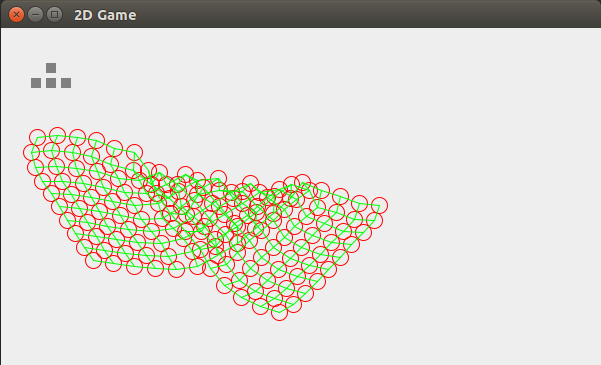

# Bound Ball Physics Engine!

## License info

Copyright (c) 2022, Geronimo Mirano.

MIT License; See LICENSE.txt for full license.

## About

Demonstration video: https://www.youtube.com/watch?v=BWtpgn0bQQo

This was a senior project I did for high school. The code is 10 years old and was not written to last ... expect rough edges!

A word of warning ... many of the demos in the above video were hardcoded in a one-off fashion at the time. Those behaviors
are still present within the code, but exhibiting them requires some hacking. For the sake of time, I'm presenting the code
as-is, which has the "mesh" demo set up... but, there are other demos to explore in the code.

Hint: try pressing the down arrow key, and then the right arrow key. And don't forget to try the mouse!

## Running the project

You should be able to compile and run the project using Java. From the command line, the following works:

    cd BoundBall
    javac PhysicsSim/*.java
    java PhysicsSim.Frame

One troubleshooting tip (WARNING: DO AT YOUR OWN RISK): To execute on Ubuntu, after installing OpenJDK, I had to edit the following file:

    sudo vi /etc/java-8-openjdk/accessibility.properties

and comment out the following line:

    # assistive_technologies=org.GNOME.Accessibility.AtkWrapper

